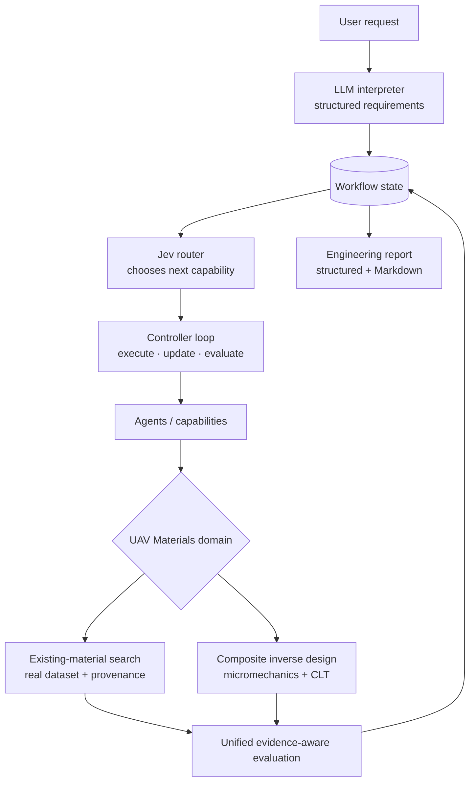

English | [中文](README.zh-CN.md)

# JevPilot

> A domain-agnostic agentic orchestration framework that connects LLM interaction, Jev routing, executable agents, and scientific models for reliable engineering workflows.

JevPilot runs an explicit, inspectable control loop over structured workflow
state. A language model interprets what the user wants, a router (Jev, an LLM
or rules) decides which capability runs next, the capabilities do the work,
and domain modules supply the real knowledge: data, physics models and the
rules for judging results.

The included demonstration is a **UAV materials workflow**: from a
natural-language request to an evidence-aware engineering report, via a
search of real material data and, when nothing existing fits, a bounded
composite design predicted by NASA-sourced physics models.

**Status: experimental research prototype (v0.1.0).** No API stability is
promised. No license has been chosen yet; that decision is left to the project
owner.

## What JevPilot Does

- **Orchestrates** capabilities (agents, tools, models, simulators, databases) with one
  generic loop: route → execute → update state → evaluate → continue or stop.
- **Routes** with a pluggable policy: `JevRouter` (Jev by TypeSafe), `LLMRouter`
  (Claude), `RuleRouter`, or an explicit `FallbackRouter` chain. Every decision is
  validated against the offered capabilities and their input schemas.
- **Keeps provenance**: every observation, artifact and measurement records where it
  came from; state transitions are pure and traced.
- **Stays domain-agnostic**: domains plug in through a small interface, and the core never
  imports them (enforced by architecture tests).

## Why JevPilot

Engineering answers need numbers you can trust, so each part of the system does
only what it is good at:

| Role | Who | What it must never do |
|---|---|---|
| **LLMs interpret** | Claude translates the request into structured requirements | invent a material property, a limit or a unit |
| **Jev routes** | Jev chooses the next capability from the state | execute anything itself |
| **Agents execute** | domain capabilities run searches, models and reports | decide what the user meant |
| **Scientific models calculate** | micromechanics and lamination theory predict properties | claim more than their equations and sources support |
| **Evaluators verify** | the evidence-aware evaluator checks requirements | treat missing evidence as failure, or predictions as measurements |

JevPilot does not ask the LLM to invent scientific measurements. Every number
in a report comes from the material dataset or a physics model, and tests check
that.

## Architecture



```text
User ─► LLM (interpret) ─► Jev (route) ─► Controller / Workflow State ─► Agents / Capabilities
                                                                      │
                                   UAV Materials Domain ◄─────────────┘
                                   ├── Existing Material Search
                                   └── Composite Inverse Design
                                              │
                                   Unified Evaluation ─► Engineering Report
```

The core (`jevpilot/`) knows nothing about UAVs or materials. The domain
(`domains/uav_materials/`) depends only on the core's public API. The
application (`apps/uav_materials/`) is the composition root: it picks the
interpreter, the router and the providers (live or offline).

## UAV Materials Workflow

```text
natural-language request
 → interpret_requirements        structured, validated engineering requirements
 → search_existing_materials     46 real materials, screened and ranked with provenance
 → assess_existing_candidates    configurable acceptance policy: use existing / design / ask
 → design_composite_candidate    (only if needed) bounded grid over V_f × symmetric layups
 → evaluate_designed_candidate   same evaluator, same requirements, side by side
 → generate_material_report      structured result + Markdown, from state only
```

Each step is an ordinary JevPilot capability with executable preconditions; the
router picks among the steps whose preconditions hold. Requirements carry a
direction where it matters (e.g. stiffness along panel axes x and y), so an
anisotropic laminate is never silently compared against an isotropic
requirement. Missing evidence is reported as an *evidence gap*, never as a
material failure, and predicted values are always labelled as predictions.

The built-in demo request asks for a UAV wing-skin material with density ≤ 1800
kg/m³, in-plane stiffness ≥ 40 GPa in x and y, and in-plane shear stiffness ≥ 15
GPa. The offline run finds that no existing material qualifies (42 of 46
violate a limit on real data, 4 cannot be judged for lack of data; the closest
by density is beryllium sheet at 1855 kg/m³), enters the design branch, and
proposes a virtual [0/45/-45/90]s AS/IMLS carbon/epoxy laminate (V_f 0.65,
predicted 1579 kg/m³, Ex = Ey = 53.4 GPa, Gxy = 20.4 GPa), while stating
clearly that its strength, corrosion and temperature behaviour are not
predicted.

## Scientific Models

| Model | What it predicts | Source | Checked against |
|---|---|---|---|
| Ply micromechanics (Chamis) | density, E11, E22, G12, ν12, S11T of a unidirectional ply | NASA TM-83320, TP-3290 | the sources' worked examples and ICAN sample output |
| Classical Lamination Theory | Q, Q̄(θ), A/B/D, laminate Ex, Ey, Gxy, νxy | NASA RP-1351 | RP-1351's printed Q, Q̄(45°), A and B values; exact identities |
| Constituents | AS carbon fibre, IMLS epoxy | NASA data bank (TP-2515, TP-3290, TM-83320) | accepted only where two NASA documents agree |
| Existing materials | 46 records: strength, stiffness, density, corrosion, temperature statements | MIL-HDBK-5J, NRL AD0609618, NASA CR-80764/123773 | quote- and table-verified extraction |

These are analytical models checked against their sources' numbers, not
validated against tests of the designed laminates. Laminate strength and
failure are **not** modelled.

## Installation

Python ≥ 3.11. The only runtime dependency is `pydantic>=2.7`.

```bash
git clone https://github.com/uudam42/JevPilot.git
cd JevPilot
uv venv && uv pip install -e '.[dev]'     # or: python -m venv .venv && pip install -e '.[dev]'
```

## Quick Start

```bash
jevpilot uav-materials --demo                                # the built-in request, offline
jevpilot uav-materials --demo --request "The density must not exceed 3000 kg/m^3 ..."
jevpilot uav-materials --demo --output report.md --json report.json --quiet
python -m apps.uav_materials --demo                          # same, without the console script
```

```python
from apps.uav_materials import run_uav_material_workflow

result = run_uav_material_workflow()  # OFFLINE_DEMO with the built-in request
print(result.decision)  # "design"
print(result.markdown)  # the full engineering report
result.report  # the structured result (pydantic model)
```

## Offline Demo

`--demo` (the default) needs no credentials and no network. It is labelled
**OFFLINE_DEMO** everywhere: requirements are interpreted by a deterministic
phrase parser, and routing uses a scripted reference policy served through the
real `JevRouter` pipeline by the offline `FakeJevAdapter`. It demonstrates the
orchestration; it says nothing about live-model routing quality.

## Live LLM + Jev Setup

```bash
uv pip install -e '.[anthropic,jev]'
export ANTHROPIC_API_KEY=...        # Claude interprets the request
export TYPESAFE_API_KEY=...         # Jev routes the workflow
jevpilot uav-materials --live --request "your request"
```

Live runs are labelled **LIVE**. If a key or SDK is missing, the command stops
with a clear message and exit code 2; it never falls back to the demo
silently. The live path is implemented; offline tests cover its pieces (the LLM
interpreter with a scripted model, the LIVE wiring with dummy keys and no
network, and both provider adapters through their SDKs with mocked transports).
It has not yet been run against the live services in the development
environment (no credentials were available). An opt-in live test exists:
`JEVPILOT_LIVE_TESTS=1 pytest tests/apps/test_uav_live.py -s`. See
[REAL_ROUTING.md](docs/REAL_ROUTING.md) for provider details.

## Repository Structure

```text
jevpilot/            core orchestration (domain-agnostic): state, loop, routing, registries
integrations/        provider adapters: Claude (anthropic_llm), Jev (typesafe_jev); optional SDKs
domains/
  uav_materials/     schemas, requirements & resolver, search, evidence, decision,
                     micromechanics, CLT, inverse design, workflow, reporting
  demo/, stats_demo/ toy domains used by the core's tests
apps/
  uav_materials/     run_uav_material_workflow(), live/offline wiring, CLI
data/uav_materials/  source manifests and committed raw text extracts (PDFs are not committed)
benchmarks/, experiments/  routing benchmark and experiment harness
examples/            runnable examples (uav_end_to_end.py, compare_routers.py, ...)
tests/               unit, integration, architecture, domain and end-to-end tests
docs/                architecture, methodology and routing documentation
```

## Testing

```bash
pytest            # 677 passed, 3 skipped with the provider SDKs installed; without them the SDK tests skip
ruff check . && ruff format --check .
mypy --strict jevpilot domains experiments integrations examples apps
```

The test suite runs offline. End-to-end tests cover the design branch, the
existing-material branch (design must not run), missing requirements,
insufficient evidence, unsupported requirements, infeasible designs, report
integrity (every number in the Markdown is in the structured report, and the
structured values equal the dataset and model values), and the refusal to fall
back from LIVE to the demo.

## Data & Provenance

Every material value keeps its original unit, test conditions and a pointer to
its source (document, table or page, verbatim quote where applicable). Source
manifests in `data/uav_materials/sources/` record licence or reuse basis,
retrieval date and checksums. All sources are U.S. Government public documents
(MIL-HDBK-5J with Distribution Statement A; NASA and NRL reports marked public).
Source PDFs are not committed; the cited pages' text is, and the dataset is
rebuilt from it offline (`python -m domains.uav_materials.ingest.build`).

## Limitations

- Laminate strength and failure, corrosion, water absorption and temperature
  behaviour of designed composites are not predicted.
- Model predictions are checked against their sources' worked examples, not
  validated by experiments; constituent data are indicative handbook values.
- The existing-material dataset is small (46 records) and has gaps; the
  acceptance policy is a demonstration policy, not a design standard.
- The offline interpreter handles common phrasings only; the live LLM path
  has not been exercised against the real services yet.

## Roadmap

- Run and record the live Claude + Jev workflow.
- A sourced laminate failure criterion, so strength requirements can be answered.
- Inverse search beyond the bounded grid, once strength is supported.
- More material systems and data sources, each with explicit provenance.

## Documentation

- [ARCHITECTURE.md](docs/ARCHITECTURE.md): layers, control loop, dependency rules, applications
- [UAV_MATERIALS.md](docs/UAV_MATERIALS.md): the UAV materials methodology, end to end
- [REAL_ROUTING.md](docs/REAL_ROUTING.md): Claude and Jev integrations and the live setup
- [DOMAIN_INTERFACE.md](docs/DOMAIN_INTERFACE.md): adding a new domain without touching the core
- [ROUTING.md](docs/ROUTING.md), [STATE_MODEL.md](docs/STATE_MODEL.md),
  [DESIGN_PRINCIPLES.md](docs/DESIGN_PRINCIPLES.md),
  [BENCHMARK_DESIGN.md](docs/BENCHMARK_DESIGN.md), [EXPERIMENTS.md](docs/EXPERIMENTS.md)
