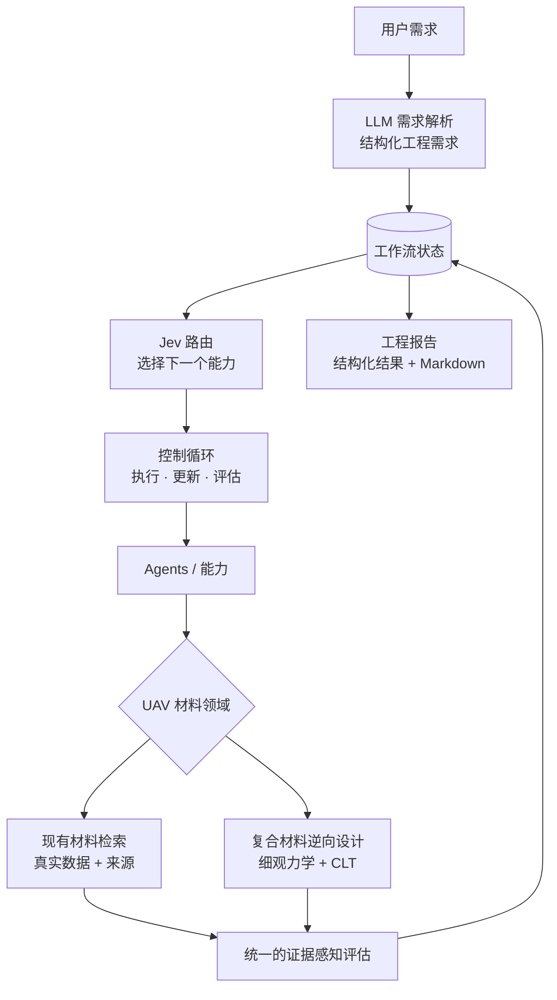

[English](README.md) | 中文

# JevPilot

> JevPilot 是一个领域无关的 Agentic AI 编排框架。上层由 LLM 负责理解用户问题，Jev 负责路由和决策，Agents/Capabilities 负责执行任务；下层领域模块提供真实专业知识、数据与科学模型。

JevPilot 用一个显式、可检查的控制循环驱动结构化的工作流状态：LLM 把用户的自然语言需求翻译成结构化需求，路由器（Jev、LLM 或规则）决定下一步调用哪个能力（capability），能力负责具体执行，领域模块提供真正的专业内容——数据、物理模型，以及判断结果好坏的规则。

仓库自带一个完整的演示：**无人机（UAV）结构材料工作流**。它从一句自然语言需求出发，先在真实材料数据中检索，若没有合适的现有材料，再在受约束的设计空间内设计复合材料候选，并用 NASA 来源的物理模型预测其性能，最后生成一份区分“证据”与“预测”的工程报告。

**状态：实验性研究原型（v0.1.0）。** 不承诺 API 稳定性。项目尚未选定开源许可证，这一决定留给项目所有者。

## JevPilot 做什么

- **编排**：用同一个通用循环调度各种能力（agent、工具、模型、仿真、数据库）：路由 → 执行 → 更新状态 → 评估 → 继续或停止。
- **路由**：路由策略可替换——`JevRouter`（TypeSafe 的 Jev）、`LLMRouter`（Claude）、`RuleRouter`，或显式的 `FallbackRouter` 链。每个决策都会按“可用能力及其输入 schema”严格校验。
- **可追溯**：每个观测、产物和测量值都记录来源；状态转换是纯函数，全过程可追踪。
- **领域无关**：领域通过一个小接口接入，核心代码从不 import 领域代码（由架构测试强制保证）。

## 为什么是 JevPilot

工程结论必须建立在可信的数字上，所以系统里的每个角色只做自己擅长的事：

| 角色 | 由谁承担 | 绝不允许做的事 |
|---|---|---|
| **LLM 负责理解** | Claude 把需求翻译成结构化工程需求 | 编造材料性能、限值或单位 |
| **Jev 负责路由** | Jev 根据当前状态选择下一个能力 | 自己执行任何操作 |
| **Agents 负责执行** | 领域能力完成检索、建模与报告 | 替用户决定“需求是什么” |
| **科学模型负责计算** | 细观力学与经典层合板理论预测性能 | 超出其方程与来源所能支撑的结论 |
| **评估器负责核验** | 证据感知的评估器检查每条需求 | 把“缺证据”当成“不合格”，或把预测当成实测 |

**JevPilot 不会让 LLM 编造科学测量值**（JevPilot does not ask the LLM to invent scientific measurements）。报告中的每一个数字都来自材料数据集或物理模型，并有测试逐一核对。

## 架构



```text
用户 ─► LLM（理解） ─► Jev（路由） ─► 控制器 / 工作流状态 ─► Agents / 能力
                                                          │
                          UAV 材料领域 ◄──────────────────┘
                          ├── 现有材料检索
                          └── 复合材料逆向设计
                                   │
                          统一评估 ─► 工程报告
```

核心（`jevpilot/`）对无人机、材料一无所知；领域（`domains/uav_materials/`）只依赖核心的公开 API；应用层（`apps/uav_materials/`）是“组装根”，负责选择需求解析器、路由器和模型提供方（在线或离线）。

## UAV 材料工作流

```text
自然语言需求
 → 工程需求结构化          interpret_requirements：带出处、经校验的工程需求
 → 搜索已有材料            search_existing_materials：46 种真实材料，带来源的筛选与排序
 → 判断是否满足            assess_existing_candidates：可配置的接受策略（用现有 / 去设计 / 需补充信息）
 → 不满足则在受约束的设计空间内生成复合材料候选
                           design_composite_candidate：纤维体积分数 × 对称铺层的有限网格
 → NASA 来源物理模型预测   细观力学 + 经典层合板理论
 → 统一评价                evaluate_designed_candidate：同一评估器、同一组需求，并排比较
 → 生成工程报告            generate_material_report：结构化结果 + Markdown，全部来自状态
```

每一步都是普通的 JevPilot 能力，并带有可执行的前置条件；路由器只在前置条件满足的步骤中做选择。需求在必要时带有方向（例如面板 x、y 方向的面内刚度），因此各向异性的层合板永远不会被悄悄地拿去和各向同性的需求比较。缺少数据时报告为“证据缺口”，而不是“材料不合格”；预测值始终标注为预测值。

内置演示需求是：无人机机翼蒙皮材料，密度 ≤ 1800 kg/m³，x、y 方向面内刚度 ≥ 40 GPa，面内剪切刚度 ≥ 15 GPa。离线运行的结论是：没有现有材料满足要求（46 种中 42 种在真实数据上违反某项限值，4 种因缺数据无法判断；按密度最接近的是铍板，1855 kg/m³），于是进入设计分支，给出一个虚拟的 [0/45/-45/90]s AS/IMLS 碳纤维/环氧层合板（纤维体积分数 0.65，预测密度 1579 kg/m³，Ex = Ey = 53.4 GPa，Gxy = 20.4 GPa），并明确说明其强度、腐蚀与温度性能没有被预测。

## 科学模型

| 模型 | 预测内容 | 来源 | 核对依据 |
|---|---|---|---|
| 单层细观力学（Chamis） | 单向铺层的密度、E11、E22、G12、ν12、S11T | NASA TM-83320、TP-3290 | 来源文献中的算例与 ICAN 样例输出 |
| 经典层合板理论（CLT） | Q、Q̄(θ)、A/B/D 矩阵，层合板 Ex、Ey、Gxy、νxy | NASA RP-1351 | RP-1351 印刷的 Q、Q̄(45°)、A、B 数值；精确恒等式 |
| 组分材料 | AS 碳纤维、IMLS 环氧 | NASA 数据库（TP-2515、TP-3290、TM-83320） | 仅接受两份 NASA 文献一致的数值 |
| 现有材料 | 46 条记录：强度、刚度、密度、腐蚀、温度说明 | MIL-HDBK-5J、NRL AD0609618、NASA CR-80764/123773 | 逐条引文 / 表格核验的提取 |

这些是解析模型，已与其来源文献的数值核对，但**没有**用所设计层合板的试验数据验证。层合板强度与失效**没有**建模。

## 安装

需要 Python ≥ 3.11，唯一的运行时依赖是 `pydantic>=2.7`。

```bash
git clone https://github.com/uudam42/JevPilot.git
cd JevPilot
uv venv && uv pip install -e '.[dev]'     # 或：python -m venv .venv && pip install -e '.[dev]'
```

## 快速开始

```bash
jevpilot uav-materials --demo                                # 内置需求，离线运行
jevpilot uav-materials --demo --request "The density must not exceed 3000 kg/m^3 ..."
jevpilot uav-materials --demo --output report.md --json report.json --quiet
python -m apps.uav_materials --demo                          # 不用控制台脚本也可以
```

```python
from apps.uav_materials import run_uav_material_workflow

result = run_uav_material_workflow()  # OFFLINE_DEMO，使用内置需求
print(result.decision)  # "design"
print(result.markdown)  # 完整的工程报告
result.report  # 结构化结果（pydantic 模型）
```

离线解析器目前识别的是常见的英文表述，因此示例需求使用英文。

## 离线演示

`--demo`（默认模式）不需要任何密钥，也不需要网络，所有输出都标注为 **OFFLINE_DEMO**：需求由确定性的短语解析器解析；路由使用一个脚本化的参考策略，经由真实的 `JevRouter` 流水线，由离线的 `FakeJevAdapter` 提供。它演示的是编排过程本身，**不代表**真实模型的路由质量。

## 在线 LLM + Jev 配置

```bash
uv pip install -e '.[anthropic,jev]'
export ANTHROPIC_API_KEY=...        # Claude 负责理解需求
export TYPESAFE_API_KEY=...         # Jev 负责路由工作流
jevpilot uav-materials --live --request "your request"
```

在线运行会标注为 **LIVE**。缺少密钥或 SDK 时，命令会给出明确提示并以退出码 2 结束，**绝不会**悄悄退回离线演示。在线路径已经实现，其各个部分都有离线测试（用脚本化模型测试 LLM 需求解析器；用假密钥、禁用网络的方式测试 LIVE 组装；两个提供方适配器通过各自 SDK 在模拟传输层上测试）；但由于开发环境中没有密钥，尚未对真实服务运行过。可选的在线测试：`JEVPILOT_LIVE_TESTS=1 pytest tests/apps/test_uav_live.py -s`。提供方细节见 [REAL_ROUTING.md](docs/REAL_ROUTING.md)。

## 仓库结构

```text
jevpilot/            领域无关的编排核心：状态、循环、路由、注册表
integrations/        模型提供方适配器：Claude（anthropic_llm）、Jev（typesafe_jev），SDK 为可选依赖
domains/
  uav_materials/     schema、需求与解析器、检索、证据、决策、细观力学、CLT、逆向设计、工作流、报告
  demo/, stats_demo/ 核心测试用的玩具领域
apps/
  uav_materials/     run_uav_material_workflow()、在线/离线组装、命令行
data/uav_materials/  来源清单与已提交的原始文本摘录（PDF 不入库）
benchmarks/, experiments/  路由基准与实验框架
examples/            可运行示例（uav_end_to_end.py、compare_routers.py 等）
tests/               单元、集成、架构、领域与端到端测试
docs/                架构、方法论与路由文档
```

## 测试

```bash
pytest            # 安装提供方 SDK 时：677 passed, 3 skipped；未安装时，依赖 SDK 的测试会被跳过
ruff check . && ruff format --check .
mypy --strict jevpilot domains experiments integrations examples apps
```

全部测试离线运行。端到端测试覆盖：设计分支、现有材料分支（此时不得进入设计）、需求缺失、现有材料证据不足、不支持的需求、无可行设计、报告完整性（Markdown 中的每个数字都能在结构化结果中找到，且结构化结果中的数值与数据集和模型输出一致），以及“LIVE 模式不得退回离线演示”。

## 数据与来源

每个材料数值都保留原始单位、测试条件和来源指针（文献、表格或页码，必要时附逐字引文）。`data/uav_materials/sources/` 中的来源清单记录了许可或复用依据、获取日期和校验和。所有来源都是美国政府公开文件（MIL-HDBK-5J 带有分发声明 A；NASA 与 NRL 报告标注为公开）。原始 PDF 不入库，入库的是被引用页面的文本，数据集可离线重建（`python -m domains.uav_materials.ingest.build`）。

## 局限性

- 所设计复合材料的强度与失效、腐蚀、吸水和温度性能均未预测。
- 模型预测只与来源文献的算例核对过，没有经过试验验证；组分材料数据是手册中的参考值。
- 现有材料数据集规模小（46 条）且有缺口；接受策略是演示用策略，不是设计标准。
- 离线解析器只识别常见表述；在线 LLM 路径尚未对真实服务运行。

## 路线图

- 运行并记录真实的 Claude + Jev 工作流。
- 引入有出处的层合板失效准则，使强度需求可以被回答。
- 在支持强度之后，把逆向搜索扩展到有限网格之外。
- 更多材料体系与数据来源，每一项都有明确出处。

## 文档

- [ARCHITECTURE.md](docs/ARCHITECTURE.md)：分层、控制循环、依赖规则、应用层
- [UAV_MATERIALS.md](docs/UAV_MATERIALS.md)：UAV 材料工作流的完整方法论
- [REAL_ROUTING.md](docs/REAL_ROUTING.md)：Claude 与 Jev 集成及在线配置
- [DOMAIN_INTERFACE.md](docs/DOMAIN_INTERFACE.md)：不改核心即可新增领域
- [ROUTING.md](docs/ROUTING.md)、[STATE_MODEL.md](docs/STATE_MODEL.md)、[DESIGN_PRINCIPLES.md](docs/DESIGN_PRINCIPLES.md)、[BENCHMARK_DESIGN.md](docs/BENCHMARK_DESIGN.md)、[EXPERIMENTS.md](docs/EXPERIMENTS.md)（英文）
